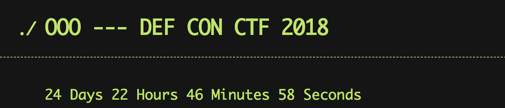

# Qualifier Scoreboard

This repository contains a number of [React](https://reactjs.org/) frontends
applications:

* countdown_frontend
* registration_frontend
* scoreboard_frontend

Additionally, the `scoreboard_backend` directory contains a
[serverless](https://serverless.com/) application for managing the server-side
components that run in AWS lambda.


# Development Prerequisites

The following are necessary in order to develop, test, and deploy the
components that make up the scoreboard.

## Frontend Dependencies

The frontend applications are all written using React. React depends on npm and
Node.js. Install node via your favorite package manager or from
https://nodejs.org/.

Additionally, the instructions below use `yarn` as the Javascript package
manager, so you will want to install `yarn` as well. Instructions for
installing yarn can be found at https://yarnpkg.com/lang/en/docs/install/.

Once yarn is installed, to develop or deploy any of the frontend application
will first require installing the application's packages. Do that via:

```sh
cd APP_frontend
yarn install
```

## Backend Dependencies

All the backend applications use serverless
https://serverless.com/framework/docs/providers/aws/guide/installation/.

Install using

```sh
npm install -g serverless
npm install --save-dev serverless-kms-secrets
```


# Frontend Applications

The frontend applications each build to static html, css, and javascript. The deployed code lives
in an S3 bucket under the `dev` and `prod` prefixes.

Cloudfront distributions are configured to serve files out of that S3 bucket
mapped to an appropriate prefix.

The S3 bucket is accessible via `Cloudfront` through the `access-identity`
Origin Access Identity:
https://console.aws.amazon.com/cloudfront/home?region=us-east-1#oai:

## Countdown



Up until the competition starts, https://scoreboard.oooverflow.io should host
the countdown_frontend. This application counts down to the start of the
competition. When the countdown is exhausted a message appears indicating to
wait for changes to propagate.

### Development

```sh
cd countdown_frontend
yarn start
```

The `index.html` file is set to be cached for 60 seconds so everyone should be
able to see updates within a minute of deployment.

## Registration

This application is where team will go to register. This application is intended to be deployed to
the production environment well before the start of the competition.

### Development

```sh
cd registration_frontend
yarn start
```

## Scoreboard

This application is the actual scoreboard that the qualifiers used. This application is intended to
be deployed to the production environment at the start of the competition.

### Development

```sh
cd scoreboard_frontend
yarn start
```

# scoreboard_backend

This directory contains a [serverless](https://serverless.com/) application for
managing the server-side components that run in AWS lambda.

If you're not familiar with lambda, each function is its own program. Some
functions are mapped to API endpoints, and others (`migrate`, `scoreboard_set`)
are only meant to be invoked directly.


## Development

By default, all the commands listed below are set up to deploy to the `dev`
environment. When making changes, first deploy to development via `sls deploy`,
or `sls deploy -f FUNCTION` to quickly push code changes to a single
function. Then re-run the test suite via `pytest`.

__Note__: If you make changes to registration, run the slow tests via `pytest
--runslow`.

Once the tests have passed on development (you've written new tests for your
changes, right?), deploy to production via `sls deploy --stage prod`. Make sure
you've coordinated the release of any respective front-end changes as well.

__Note__: For all the following `sls` commands, add `--stage prod` in order to
issue that command in the production environment.

## Setting the challenges

To rewrite the set of challenges (this is a destructive action), first create a
`scoreboard.json` file by utilizing the
[challs-manger](https://github.com/o-o-overflow/challs-manager) program:

```sh
./challenge_loader.py loadall [.challs file path] --dump scoreboard.json
```

Noting where `scoreboard.json` is saved as `SCOREBOARD_JSON_PATH`, run the
following command to update the challenges on the scoreboard:

```sh
cd scoreboard_backend
sls invoke -lf challenges_set --path SCOREBOARD_JSON_PATH
```


## Opening a challenge

Run the following:

```sh
cd scoreboard_backend
sls invoke -lf challenge_open -d '{"id": "CHALLENGE_ID"}'
```


## Helper Scripts

### Reset Password

```sh
cd scoreboard_backend
STAGE=prod ./scripts/reset_password.sh USERNAME PASSWORD
```

Note: the password must be at least 10 characters.


## Other Comments

Run `terraform apply` to build/update the scoreboard infrastructure in AWS.

After running for the first time a few values have to be updated:

In `serverless.yml`

* `securityGroupIds` needs to be set to the ID of the lambda security group
* `subnetIds` needs to be set to all of the private subnet ids
* `DB_HOST` needs to be updated to the endpoint of the RDS instance
